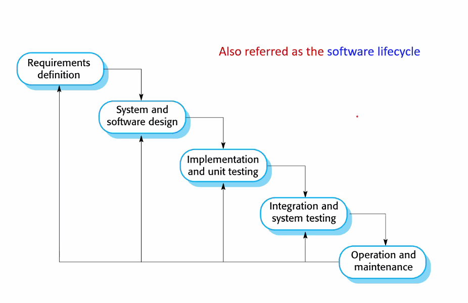
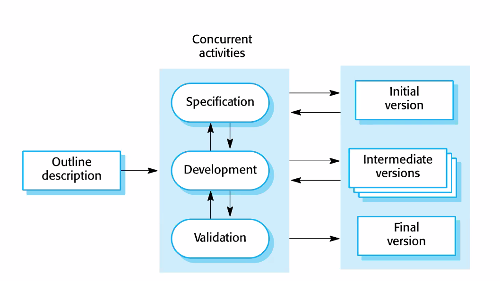
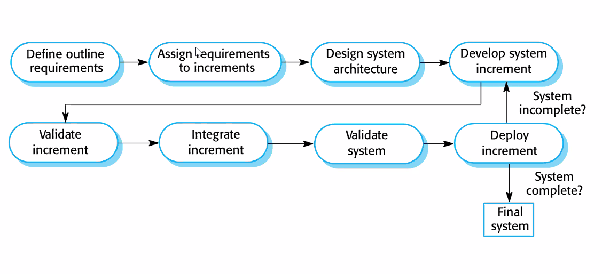
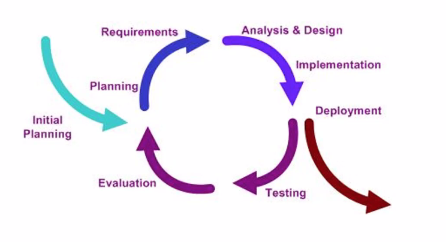
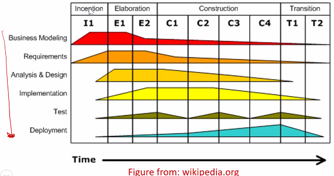
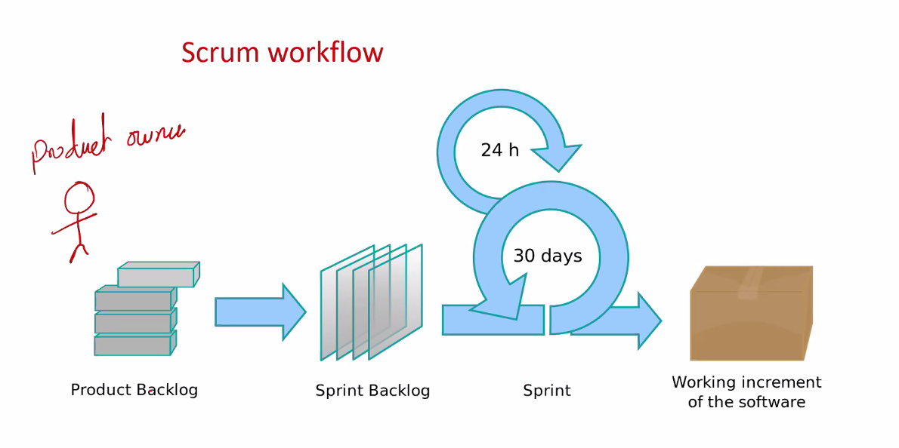
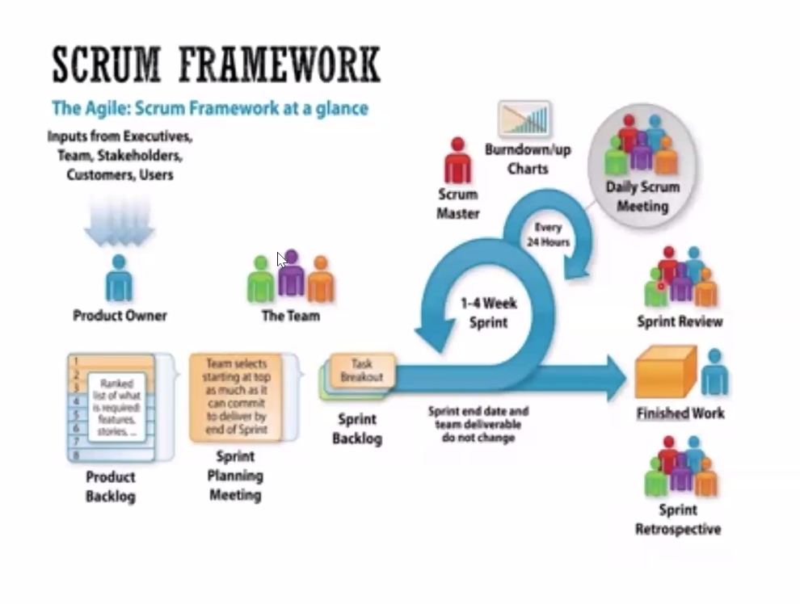
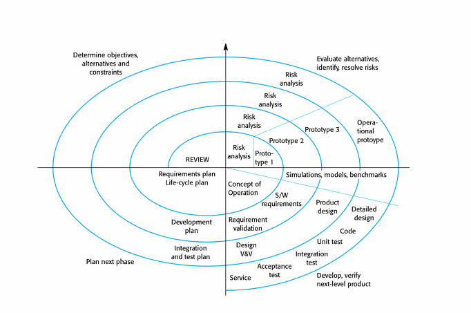
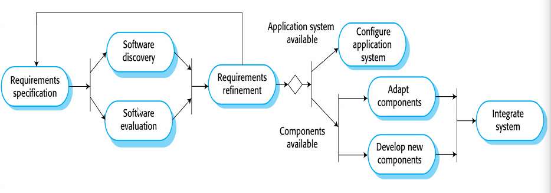
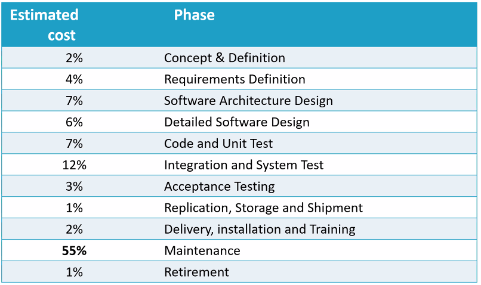

# Software Development Process

The process of developing software is generally broken down into the following phases:

- **Specification** (or **Requirements Engineering**) - defining what the system should do
- **Design** **and** **implementation** - defining the org
- **Validation** - checking that it does what the customer wants
- **Evolution** - changing in response to customer needs

 

### Requirements engineering 

- Generally the first step
- Process of understanding and defining what services are required and identifying the constraints on these services
- Ensures software will meet the user expectations
- Cost of correcting requirements errors increases **exponentially** across development cycle, so it pays off to have well defined requirements

 

### Software design and implementation

- Design
- Description of structure
  
- Implementation

 

### Software verification and validation

- - More general than just testing

    - Testing: executing the system using a set of test cases with the intent of finding and removing       bugs

 

### Software evolution

- 4 types of maintenance
- **Corrective**: Fixing errors
  - **Adaptive**: Changing for new environment (ex. New OS)
  - **Perfective**: Adding new functionality
  - **Preventive**: Preventing errors

# Types of Processes

- **Plan driven**

  - Activities planned in advance and progress is measured against plan

  - **Agile**

    - Planning is incremental and iterative, easier to change the process to reflect changing requirements

  - **Process models**

    - **Waterfall**

    - Incremental dev

    - Iterative dev

    - **Agile** dev

    - Reuse-oriented dev

    - Prototyping

    - Spiral model

    - Formal transformation

      

  ## Waterfall Model

- **Main drawback**:

  - Difficulty of accommodating change once the process is underway

  - More problems

    - Inflexible partitioning of the project
    - Mostly used for large systems

  - In principle, phases must be completed sequentially
  
    

## Incremental Model

- Cost of accommodating changing requirements is reduced

- Easier to get feedback

- Rapid development

- Early increments act as prototype

- Lower risk of overall project failure

- Highest priority system services tend to receive the most testing

- Problems

  - Process is not visible
  - Structure tends to degrade as new increments are added
  - Problematic when new system is intended to replace an existing system

### Coping with change

- Change is inevitable
- Business change
  
- **Change anticipation**
  
  - Process includes activities that can anticipate possible changes before significant rework is       required
  
- **Change tolerance**
  
  - Where the process is designed for changes to be accommodated at relatively low cost
  
- Two ways of coping:
  
  - System **prototyping**
    - A version of the system is developed quickly to check the requirements and feasibility of design decisions - supports change anticipation
    
    - **Incremental delivery**

      - System increments are delivered to the customer incrementally - supports change tolerance

### Prototyping Model

- - Prototype: an initial version of a system used to demonstrate concepts and try out design options

  - Can be used in:

    - The requirements engineering process
    - In design process - explore options
    - In testing process - run back to back tests

  - **Benefits**

    - Improve system usability
    - Closer match to users needs
    - Improved design quality
    - Improved maintainability
    - Reduced development effort

  - May be based on rapid prototyping tools

  - May have to remove features for speed's sake

### Iterative Development

Includes the elements of the waterfall model, but organized into an iterative, incremental process.

## Rational Unified Process (RUP)

- business value is delivered incrementally in time boxed cross discipline iterations

  

- Phases in the RUP

  - **inception** - business case for the system
  - **elaboration** - defining requirements, analysis and design
  - **construction** - implementation, some testing, some deployment
  - **transition** - deployment

- **in phase iteration**

  - each phase is iterative

- **cross phase iteration**

  - whole set of phases may be enacted iteratively

    

## Agile Development

- System is developed through small, frequent, incremental releases

  - Requirements include relatively simple customer stories, easy to modify

  - Complete requirements document not usually created

  - Customers are continuously engaged, and their representatives

  - Agile manifesto (2001)

  - We value

    - **Individuals and interactions** over processes and tools
    - **Working software** over comprehensive documentation
    - **Customer collaboration **over contract negotiation
    - **Responding to change** over following a plan

  - More methodologies:

    - **Scrum**
      
    - Kanban
  
    - Extreme programming  (xp)
  
    - Dsdm - dynamic system development method
  
      

## Scrum

### Scrum methodology

- Scrum roles

  - **Product owner** - owns the backlog, requirements are prioritized based on user's needs. User stories are stored in the backlog
  - **Dev team** - uses user stories to develop features and fix bugs
  - **Scrum master** - owns the scrum process, interfaces with the rest of the company

- Product requirements are referred to as product backlog - includes features, bug fixes,      requirements, etc.

- Requirements are represented as user stories

  

- Types of meetings:

  - Sprint Planning: 
  - **Daily Scrum**: short meeting, scrum master/devs, state progress highlight progress, ask for help
  - **Sprint review**: demonstrate product
  - **Sprint Retrospective**: analyze the process

- Artifacts:

  - **Product Backlog**: ranked list of what is required

  - **Sprint Backlog**: subset of the product backlog

  - **Burndown Chart**: progress of the current sprint, completed user stories are "burned", remaining work should decrease over time towards 0 (finished)

    

Compared to RUP, scrum places less emphasis on documentation. Scrum is a methodology not a process. There are no predefined phases, remember: *individuals and interactions over process and tools*. 

## Boehm's Spiral Model

- Iterative and incremental model
- Identified by **risk analysis**

## Reuse-oriented development

Based on systematic reuse where systems are integrated from existing components. Sometimes called COTS - commercial off the shelf systems. Reused elements may be configured to adapt their behavior.

## Formal Transformation Model

Based on the transformation of a mathematical specification through different representations to an executable program.

- problems
  - need for specialized skills

## Our software process

- requirements elicitation
- analysis
- system design
- object design
- implementation
- testing

## Software Cost Distribution

